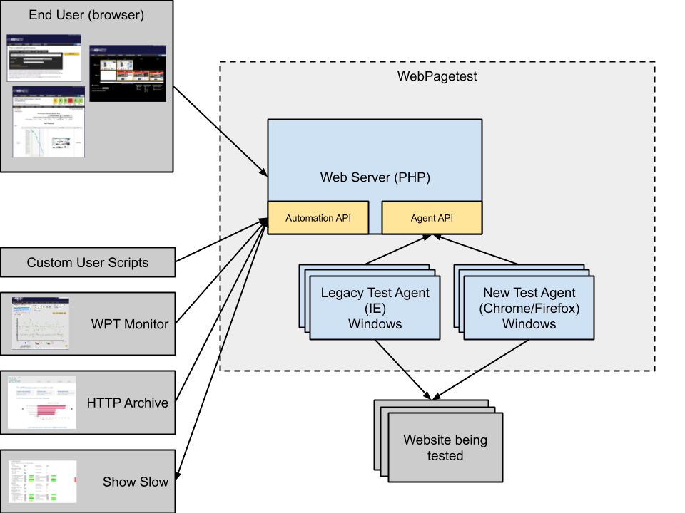

# Overview
Note: These docs are outdated and parts reference the old agent architecture

Here is the overall system design for WebPagetest:

All communications are done over HTTP and the direction of the arrows indicates the direction of the HTTP requests.  The test agents poll the server looking for work and post the results back to the server when testing is complete.
