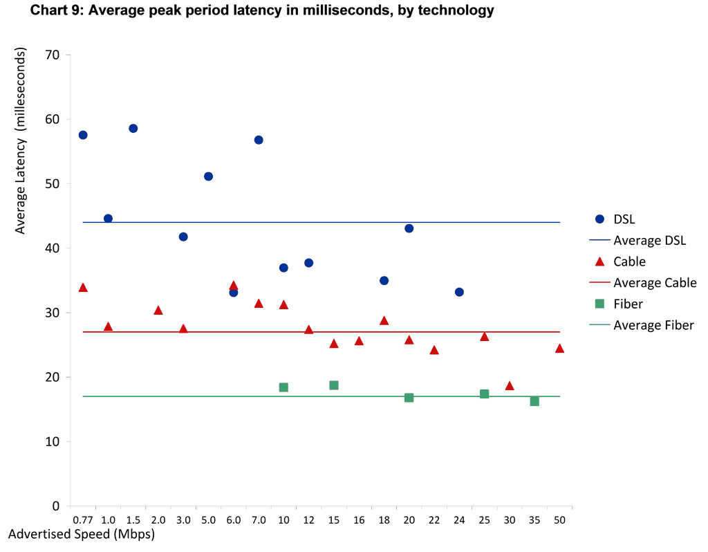
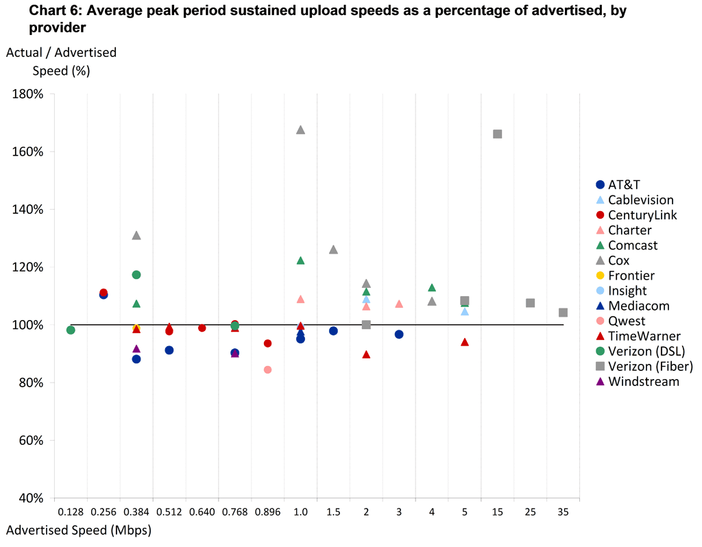

# 2011 FCC Broadband Data
The FCC prepared a report on the state of Broadband Internet access in the US and the data is useful for deciding on connectivity parameters used for testing.  I'm including the key charts here but the full report is available here: http://www.fcc.gov/document/measuring-broadband-america-report-consumer-broadband-performance-us

## Connectivity Emulation (dummynet)
The purpose of the connectivity emulation in WebPagetest is to provide realistic "last mile" performance from the test agents (but not to alter additional latency in getting to servers physically distributed).  This means that the goal is to realistically emulate parts 2-6 of the network diagram from the FCC report with the public Internet segment being routed as it would normally:

## Latency and Advertised Bandwidth
The test servers used in the FCC testing were geographically distributed close to the measurement locations and validated against measurement points within the provider's network so the latency measurements should be accurate measurements of the part of the network that we are looking to duplicate in dummynet.

## Downstream Bandwidth

## Upstream Bandwidth

