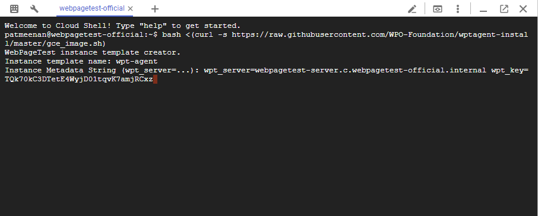
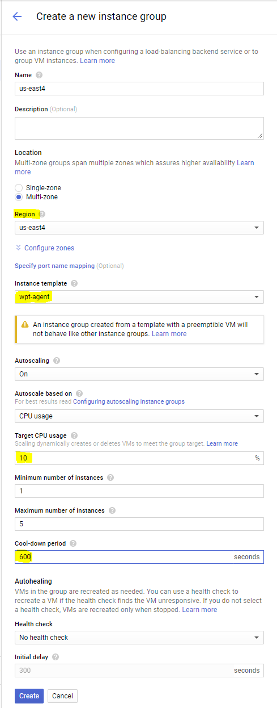

# Google Cloud Test Agents
There is a public image available for creating test agent instances. The agents automatically install all system and browser updates before starting testing so there is no need to manually update the image.

If you are using the agents with a server in Google cloud, make sure to set up the server first so you will have the agent configuration information available.

## Create an Instance Template
There is a setup script that will automatically create an instance template for preemptable n1-standard-2 instances using the public image (the recommended configuration).

In the top-right corner of the Google cloud console is a button to launch the cloud shell:


Launch the shell and when it is running, paste the command to create the image template:
```bash
bash <(curl -s https://raw.githubusercontent.com/WPO-Foundation/wptagent-install/master/gce_image.sh)
```

The shell will prompt you for the template name and metadata configuration string to use for the instances (the string was provided at the end of the server setup script).


After a few seconds the script will complete and there will be an instance template in the project that can be used for launching agents in any region (manually or as part of a managed instance group).

## Auto-Scaling

The linux agents auto-scale well for bulk testing using a [Managed Instance group](https://cloud.google.com/compute/docs/instance-groups/).  In that mode it is recommended to use preemptable instances and set a target CPU utilization to 10% (for n1-standard-2 instances) and with a cool-down period of 600 seconds.  One instance will need to be running in each region at all times and it will scale up as needed when running tests.

The instances take a few minutes to connect to the server after launching because they install all of the latest OS and browser updates and reboot before starting to process work.


